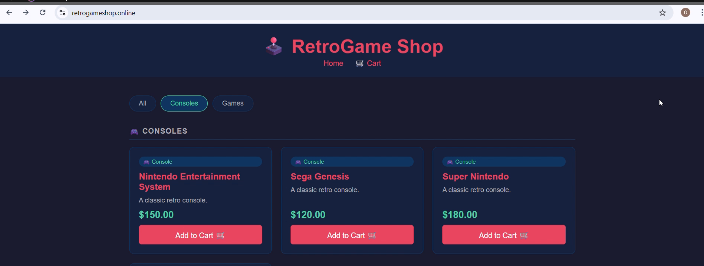
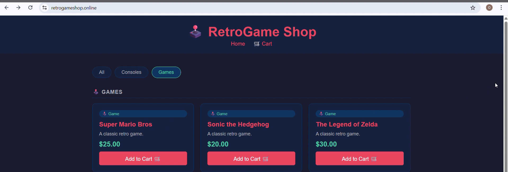
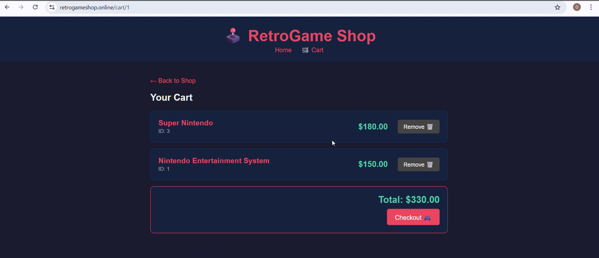

# 🕹️ RetroGame Microservices
End-to-end DevOps project | Microservices in 5 languages | Containerized with Docker | Orchestrated with Kubernetes | CI/CD with GitHub Actions | GitOps with ArgoCD

[](https://retrogameshop.online)
[](https://hub.docker.com/u/oghenetejiri798)
[](https://github.com/Edwin-Oghenetejiri1/retrogame-k8s-manifests)

---

## 📋 Overview

RetroGame Shop is a full-stack e-commerce platform for retro gaming products built as a microservices architecture. This repository demonstrates real-world DevOps practices including containerization, multi-language CI/CD pipelines, container security scanning, and cloud-native deployment on AWS EKS.

---

## 🧩 What Are Microservices and Why Do They Matter?

Traditional applications are built as a single monolithic codebase — one giant application that handles everything. When it breaks, everything breaks. When you want to scale one feature, you scale the entire app. When one team makes a change, they risk breaking another team's work.

**Microservices solve this by breaking the application into small, independent services that each do one thing well.**

### Key Benefits:

**🔧 Independent Deployment**
Each service is deployed independently. Updating the cart service never touches the frontend or payment service. Faster releases, lower risk.

**🌐 Language and Framework Freedom**
Each team can choose the best tool for their service. This project uses Node.js, Go, Python, Java and C# — all working together seamlessly. No one language choice constrains the entire system.

**📈 Granular Scalability**
Scale only what needs scaling. If the product service is under heavy load, scale just that service — not the entire application. This saves significant infrastructure cost.

**🛡️ Fault Isolation**
One service failing does not bring down the whole system. If the notification service goes down, users can still browse products and checkout. This is called designing for failure — a core principle of resilient systems.

**👥 Team Autonomy**
Different teams can own different services. The frontend team works independently of the backend team. No merge conflicts, no waiting on other teams, no communication overhead.

**🔍 Easier Debugging and Monitoring**
Each service has its own logs, metrics and health checks. When something goes wrong you know exactly which service to look at — not a 100,000 line monolith.

**🚀 Technology Evolution**
You can rewrite or upgrade individual services without touching the rest of the system. Migrating from Python 2 to Python 3? Only the affected service needs updating.

---

## 🎯 Objectives

- **Containerization:** Package each microservice as a Docker container with its own Dockerfile
- **CI/CD Pipelines:** Automate build, test, scan and deploy for each service independently
- **Security Scanning:** Scan Docker images for vulnerabilities using Trivy
- **GitOps:** Use ArgoCD to manage Kubernetes deployments from a separate manifests repo
- **Multi-language:** Demonstrate DevOps practices across 5 different programming languages

---

## 🏗️ Architecture
```
┌─────────────────────────────────┐
│      Frontend (Node.js)         │
│         Port: 3000              │
└──────────────┬──────────────────┘
│ calls internally via HTTP
┌──────────┴──────────────┐
│                         │
▼                         ▼
Product Service (Go)    Cart Service (Python)
Port: 8080              Port: 8081
│                         │
▼                         ▼
Order Service (Java)    Payment Service (C#)
Port: 8082              Port: 8083
│
▼
Notification Service (Python)
Port: 8084
```

---

## 🛠️ Tech Stack

| Service | Language | Framework | Port |
|---|---|---|---|
| Frontend | Node.js | Express + EJS | 3000 |
| Product Service | Go | net/http | 8080 |
| Cart Service | Python | Flask | 8081 |
| Order Service | Java | Spring Boot | 8082 |
| Payment Service | C# | ASP.NET Core | 8083 |
| Notification Service | Python | Flask | 8084 |

---

## 🔄 CI/CD Pipeline

Each service has its own independent GitHub Actions workflow:

Code pushed to main
↓

Unit Tests
├── Install dependencies
└── Run language specific tests
↓
Linting and Code Quality
├── Enforce code standards
└── Language specific linters
↓
Security Scan (Trivy)
├── Scan Docker image for CVEs
└── Upload results to GitHub Security tab
↓
Docker Build & Push
├── Build image
├── Tag with run_id (traceability)
└── Push to DockerHub
↓
Update K8s Manifests
├── Update image tag in retrogame-k8s-manifests
└── Open Pull Request for review
↓
ArgoCD Auto Sync
└── Deploys new version to EKS on PR merge

### Workflows per Service

| Service | Workflow | Test Tool | Lint Tool |
|---|---|---|---|
| Frontend | frontend-ci.yaml | npm test | ESLint |
| Product Service | product-service-ci.yaml | go test | golangci-lint |
| Cart Service | cart-service-ci.yaml | pytest | Ruff |
| Order Service | order-service-ci.yaml | mvn test | Checkstyle |
| Payment Service | payment-service-ci.yaml | dotnet test | dotnet format |
| Notification Service | notification-service-ci.yaml | pytest | Ruff |

---

## 🔒 Security Scanning with Trivy

Every Docker image is scanned for vulnerabilities before pushing to DockerHub:

```yaml
- name: Run Trivy vulnerability scan
  uses: aquasecurity/trivy-action@master
  with:
    image-ref: ${{ env.IMAGE_NAME }}
    format: 'sarif'
    output: 'trivy-results.sarif'
    severity: 'CRITICAL,HIGH'

- name: Upload scan results to GitHub Security tab
  uses: github/codeql-action/upload-sarif@v3
  with:
    sarif_file: 'trivy-results.sarif'
```

Results are visible in the **Security tab** of this repository.

---

## 🚀 Running Locally with Docker Compose

### Prerequisites
- Docker Desktop installed
- Docker Compose installed

### Steps

**1. Clone the repository:**
```bash
git clone https://github.com/Edwin-Oghenetejiri1/retrogame-microservices-k8s.git
cd retrogame-microservices-k8s
```

**2. Start all services:**
```bash
docker-compose up --build
```

**3. Access the application:**
http://localhost:3000

### Individual Service URLs

| Service | URL |
|---|---|
| Frontend | http://localhost:3000 |
| Product Service | http://localhost:8080 |
| Cart Service | http://localhost:8081 |
| Order Service | http://localhost:8082 |
| Payment Service | http://localhost:8083 |
| Notification Service | http://localhost:8084 |

**Stop all services:**
```bash
docker-compose down
```

---

## 🖥️ Application Screenshots

### Home Page


### Consoles Category


### Games Category


### Shopping Cart


---

## 🔍 Verify Services from Terminal

Some services like the notification and order service are backend only with no UI. Use these commands to verify they are running correctly after `docker-compose up`:

**Check all services are healthy:**
```bash
# Product Service
curl http://localhost:8080/health
# Expected: {"status":"healthy","service":"product-service"}

# Cart Service
curl http://localhost:8081/health
# Expected: {"status":"healthy"}

# Order Service
curl http://localhost:8082/actuator/health
# Expected: {"status":"UP"}

# Payment Service
curl http://localhost:8083/health
# Expected: {"status":"healthy"}

# Notification Service
curl http://localhost:8084/health
# Expected: {"status":"healthy"}
```

**Check products are loading:**
```bash
curl http://localhost:8080/products
```

**Add item to cart:**
```bash
curl -X POST http://localhost:8081/cart/user1/add \
  -H "Content-Type: application/json" \
  -d '{"id": "1", "name": "Nintendo Entertainment System", "price": "150"}'
```

**View cart:**
```bash
curl http://localhost:8081/cart/user1
```

---

## 🐳 Docker Images

All images are available on DockerHub with two tags:
- `:latest` — most recent build
- `:<run_id>` — specific build for traceability and rollback

| Service | Image |
|---|---|
| Frontend | oghenetejiri798/frontend:latest |
| Product Service | oghenetejiri798/product-service:latest |
| Cart Service | oghenetejiri798/cart-service:latest |
| Order Service | oghenetejiri798/order-service:latest |
| Payment Service | oghenetejiri798/payment-service:latest |
| Notification Service | oghenetejiri798/notification-service:latest |

---

## 📁 Repository Structure
```
retrogame-microservices-k8s/
├── src/
│   ├── frontend/                  # Node.js + Express + EJS
│   │   ├── app.js
│   │   ├── views/
│   │   ├── Dockerfile
│   │   └── package.json
│   ├── product-service/           # Go
│   │   ├── main.go
│   │   └── Dockerfile
│   ├── cart-service/              # Python + Flask
│   │   ├── main.py
│   │   ├── requirements.txt
│   │   └── Dockerfile
│   ├── order-service/             # Java + Spring Boot
│   │   ├── src/
│   │   ├── pom.xml
│   │   └── Dockerfile
│   ├── payment-service/           # C# + ASP.NET Core
│   │   ├── Program.cs
│   │   └── Dockerfile
│   └── notification-service/      # Python + Flask
│       ├── main.py
│       ├── requirements.txt
│       └── Dockerfile
├── .github/
│   └── workflows/
│       ├── frontend-ci.yaml
│       ├── product-service-ci.yaml
│       ├── cart-service-ci.yaml
│       ├── order-service-ci.yaml
│       ├── payment-service-ci.yaml
│       └── notification-service-ci.yaml
└── docker-compose.yaml
```

## 🔗 Related Repositories

| Repository | Description |
|---|---|
| [RetroGame K8s Manifests](https://github.com/Edwin-Oghenetejiri1/retrogame-k8s-manifests) | Kubernetes deployment manifests managed by ArgoCD |
| [RetroGame EKS Infrastructure](https://github.com/Edwin-Oghenetejiri1/retrogameshop-eks-infra) | Terraform EKS infrastructure with GitHub Actions CI/CD |

---

## 🌐 Live Deployment

The application is live on AWS EKS at:

**[https://retrogameshop.online](https://retrogameshop.online)**

Deployed with:
- ✅ AWS EKS — managed Kubernetes
- ✅ ArgoCD — GitOps continuous deployment
- ✅ Prometheus + Grafana — monitoring and observability
- ✅ Karpenter — auto scaling
- ✅ SSL — AWS ACM certificate
- ✅ Custom domain — Route 53 + Hostinger
